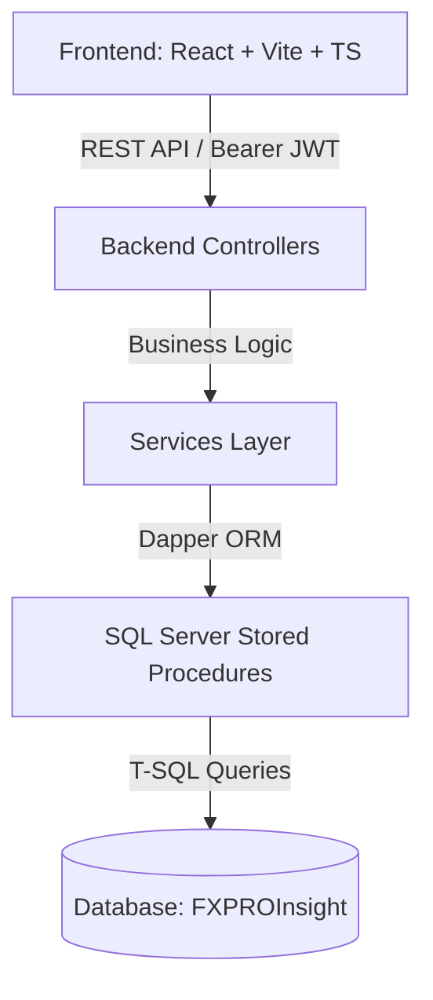

# Hướng Dẫn Chi Tiết Hệ Thống, Logic, Luồng Hoạt Động và Hướng Dẫn Phát Triển (LNT Insight)

Tài liệu này tổng hợp toàn bộ kiến trúc, luồng hoạt động, cấu trúc tệp tin trọng yếu và **danh sách kiểm tra (checklist) mà AI / Lập trình viên cần đọc** mỗi khi bắt đầu phát triển một tính năng mới trong hệ thống **LNT Insight**.

---

## 1. Tổng Quan Kiến Trúc Hệ Thống

Hệ thống **LNT Insight** được thiết kế theo kiến trúc Client-Server hiện đại:
* **Backend (`Backend_LNT_Insight`)**:
  * Nền tảng: **ASP.NET Core Web API** (.NET 8/9).
  * ORM / Data Access: **Dapper ORM** kết nối với **SQL Server Database (`FXPROInsight`)**.
  * Tư duy xử lý dữ liệu: Tối ưu hiệu năng thông qua việc gọi các **Stored Procedures (SP)** được định nghĩa trong thư mục `SSMS/`.
  * Xác thực & Phân quyền: **JWT (JSON Web Token)** kết hợp Refresh Token.
* **Frontend (`Frontend_LNT_Insight`)**:
  * Nền tảng: **React (SPA) + TypeScript + Vite**.
  * Cấu trúc giao diện: **Feature-Based** (chia mô-đun độc lập theo chức năng như `auth`, `dashboard`, `adminPage`, `master-data`).
  * Xử lý HTTP API: **Axios / Custom Fetch Client (`httpClient.ts`)** bọc sẵn logic tự động chèn JWT Token, xử lý Refresh Token âm thầm (401 Unauthorized), và chuyển đổi kiểu đặt tên key (PascalCase <-> camelCase).

---

## 2. Các Luồng Hoạt Động Chính (Core System Flows)

### 2.1 Luồng Xác Thực (Authentication & Authorization Flow)
1. User nhập thông tin đăng nhập tại `LoginPage.tsx`.
2. Frontend gọi API `POST /api/Auth/login` (`AuthController.cs`).
3. Backend kiểm tra tài khoản, trả về `AccessToken` (JWT ngắn hạn) và `RefreshToken` (dài hạn).
4. Frontend lưu Token và tự động đính kèm vào Header `Authorization: Bearer <token>` trong mọi request thông qua `httpClient.ts`.
5. Khi `AccessToken` hết hạn, `httpClient.ts` bắt mã lỗi `401 Unauthorized` và tự động gửi request lấy token mới (`POST /api/Auth/refresh-token`) mà không làm gián đoạn trải nghiệm người dùng.

### 2.2 Luồng Điều Hướng & Phân Quyền Giao Diện (Routing & Navigation Flow)
1. `routes.tsx` định nghĩa các danh mục tuyến đường:
   * `PublicRoute`: Các trang công khai (như `/login`). Nếu đã đăng nhập sẽ tự chuyển hướng vào trang chính.
   * `ProtectedRoute`: Các trang yêu cầu đăng nhập, được bọc bởi `MainLayout.tsx` (chứa `Header.tsx` và `Sidebar.tsx`).
2. `Sidebar.tsx` lấy danh sách Phân hệ / Mô-đun (`Modules` và `SubModules`) từ MasterData API tương ứng với quyền của người dùng.
3. Khi người dùng bấm vào sub-module trên Sidebar:
   * Hệ thống tra cứu route tương ứng trong `routesConfig.ts`.
   * Nếu tính năng chưa được định nghĩa route hoặc đang phát triển, hệ thống tự động fallback chuyển về trang `/coming-soon` (`BlankPage.tsx`).

### 2.3 Luồng Truy Vấn & Thao Tác Dữ Liệu (Data Operations Flow)
`Component UI` $\rightarrow$ `Feature Service/API` $\rightarrow$ `httpClient.ts` $\rightarrow$ `Backend Controller` $\rightarrow$ `Backend Service` $\rightarrow$ `Dapper SP` $\rightarrow$ `SQL Server DB`.

---

## 3. Cấu Trúc File Trọng Yếu Đáng Chú Ý

### Backend (`Backend_LNT_Insight/`)
* [Program.cs](file:///d:/LNTSoft_Business_Solution/Source/LNT_Insight/Backend_LNT_Insight/Program.cs): Khai báo Dependency Injection (Services/Repositories), Swagger, CORS, Middleware xác thực JWT.
* [Controllers/](file:///d:/LNTSoft_Business_Solution/Source/LNT_Insight/Backend_LNT_Insight/Controllers): Nhận HTTP Request (Ví dụ: `AuthController.cs`, `MasterDataController.cs`, `MD3SMD2Controller.cs`).
* [Services/](file:///d:/LNTSoft_Business_Solution/Source/LNT_Insight/Backend_LNT_Insight/Services): Logic nghiệp vụ chính và các hàm thực thi Dapper gọi Stored Procedure.
* [Dtos/](file:///d:/LNTSoft_Business_Solution/Source/LNT_Insight/Backend_LNT_Insight/Dtos): Đối tượng truyền tải dữ liệu Request/Response giữa API và Client.
* [DataConfig/](file:///d:/LNTSoft_Business_Solution/Source/LNT_Insight/Backend_LNT_Insight/DataConfig): Chuỗi kết nối DB và cấu hình kết nối Dapper.
* [SSMS/](file:///d:/LNTSoft_Business_Solution/Source/LNT_Insight/Backend_LNT_Insight/SSMS): Thư mục lưu vết các câu lệnh SQL Create Table & Stored Procedures.

### Frontend (`Frontend_LNT_Insight/src/`)
* [app/routes.tsx](file:///d:/LNTSoft_Business_Solution/Source/LNT_Insight/Frontend_LNT_Insight/src/app/routes.tsx): Khai báo cây Route toàn ứng dụng.
* [core/api/httpClient.ts](file:///d:/LNTSoft_Business_Solution/Source/LNT_Insight/Frontend_LNT_Insight/src/core/api/httpClient.ts): Động cơ gửi API requests, xử lý JWT, bẫy lỗi 401 & Refresh token.
* [core/api/](file:///d:/LNTSoft_Business_Solution/Source/LNT_Insight/Frontend_LNT_Insight/src/core/api): Các file gọi API hệ thống (`auth.ts`, `companies.ts`, `md3smd2.ts`, `masterData.ts`).
* [features/](file:///d:/LNTSoft_Business_Solution/Source/LNT_Insight/Frontend_LNT_Insight/src/features): Chứa các module tính năng (ví dụ `adminPage`, `dashboard`, `auth`). Mỗi feature chứa `pages/`, `components/`, `services/`, `types/`.
* [layouts/](file:///d:/LNTSoft_Business_Solution/Source/LNT_Insight/Frontend_LNT_Insight/src/layouts): `MainLayout.tsx`, `Header.tsx`, `Sidebar.tsx`.
* [types/](file:///d:/LNTSoft_Business_Solution/Source/LNT_Insight/Frontend_LNT_Insight/src/types): Interfaces định kiểu TypeScript toàn hệ thống.

---

## 4. CHECKLIST: Cần đọc gì khi bắt đầu phát triển tính năng mới?

Khi được yêu cầu phát triển một tính năng mới trong dự án **LNT Insight**, AI / Developer cần thực hiện đọc mã nguồn theo thứ tự từng bước sau:

### Bước 1: Khảo sát Backend
1. **Kiểm tra/tạo Stored Procedure (`SSMS/`)**: Xem bảng DB liên quan và các SP truy vấn/thao tác dữ liệu.
2. **Kiểm tra/tạo DTOs (`Dtos/`)**: Khai báo C# class cho Request và Response.
3. **Kiểm tra/tạo Service (`Services/`)**: Viết hàm Dapper tương tác với SP.
4. **Kiểm tra/tạo Controller (`Controllers/`)**: Định nghĩa HTTP Method (`[HttpGet]`, `[HttpPost]`, `[HttpPut]`, `[HttpDelete]`), gán `[Authorize]` và route chuẩn.
5. **Kiểm tra `Program.cs`**: Đảm bảo Service mới đã được đăng ký vào DI Container (`builder.Services.AddScoped<...>()`).

### Bước 2: Khảo sát Frontend
1. **Kiểm tra/tạo Types (`src/types/` hoặc `features/[feature]/types/`)**: Định nghĩa interface TypeScript tương ứng với DTO từ Backend.
2. **Kiểm tra/tạo Service Gọi API (`src/core/api/` hoặc `features/[feature]/services/`)**: Sử dụng `httpClient` để gọi API Backend.
3. **Tạo Component/Page (`src/features/[feature]/pages/`)**: Dựng giao diện trang tính năng mới, kết nối state và gọi service API.
4. **Đăng ký Route (`src/app/routes.tsx` & `routesConfig.ts`)**: Thêm đường dẫn cho trang mới vào React Router.
5. **Cấu hình Menu/Sidebar (`src/layouts/Sidebar.tsx`)**: Đảm bảo phân hệ/sub-module mới xuất hiện đúng trên menu điều hướng.

---
*Lần tới khi phát triển tính năng mới, bạn chỉ cần yêu cầu AI: **"Đọc file Document/DEVELOPMENT_GUIDE.md để nắm luồng hệ thống và bắt đầu triển khai tính năng X"**.*
