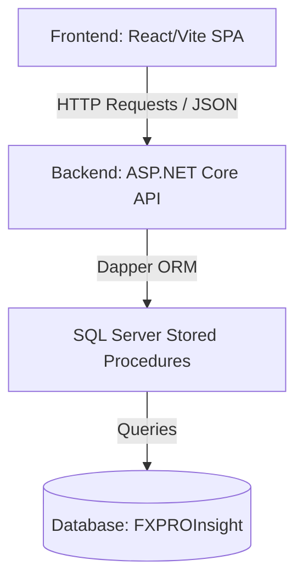

# Tài liệu Tổng Quan Cấu Trúc Dự Án LNT Insight

Tài liệu này cung cấp cái nhìn tổng quan về kiến trúc hệ thống, cấu trúc mã nguồn của cả hai phần **Backend** và **Frontend** thuộc dự án **LNT Insight**.

---

## 1. Kiến Trúc Tổng Quan (Architecture Overview)

Dự án được xây dựng theo mô hình **Client-Server**:
*   **Backend**: Cung cấp API RESTful sử dụng **ASP.NET Core Web API**, kết nối cơ sở dữ liệu qua **Dapper ORM** để thực thi các **Stored Procedure (SP)** tối ưu hiệu năng.
*   **Frontend**: Ứng dụng Single Page Application (SPA) phát triển trên nền tảng **React**, **TypeScript**, và **Tailwind CSS (Vite)**, tổ chức theo mô hình **Feature-Based (Tách biệt theo tính năng)**.



---

## 2. Cấu Trúc Chi Tiết Backend (Backend Structure)

Thư mục chính: `Backend_LNT_Insight/`

*   `Controllers/`: Tiếp nhận các yêu cầu HTTP từ client và điều hướng xử lý.
    *   `AuthController.cs`: Xử lý đăng nhập (`login`) và cấp lại/thiết lập mật khẩu (`reset-password`).
    *   `MasterDataController.cs`: Cung cấp danh mục dùng chung (Modules, Sub-modules, Users).
*   `Services/`: Lớp xử lý logic nghiệp vụ (Business Logic Layer).
    *   `Auth/`: Triển khai các phương thức kiểm tra thông tin đăng nhập, sinh JWT token và refresh token.
*   `Dtos/` (Data Transfer Objects): Định nghĩa các cấu trúc dữ liệu gửi và nhận qua API (ví dụ: `LoginRequest`, `ResetPasswordRequest`).
*   `Helpers/`: Chứa các tiện ích dùng chung (Mã hóa mật khẩu, sinh JWT token...).
*   `DataConfig/`: Cấu hình kết nối cơ sở dữ liệu SQL Server.
*   `SSMS/`: Chứa các script SQL tạo bảng và Stored Procedure chạy trong SQL Server Management Studio.

---

## 3. Cấu Trúc Chi Tiết Frontend (Frontend Structure)

Thư mục chính: `Frontend_LNT_Insight/`

Cấu trúc mã nguồn trong thư mục `src/` tuân thủ nguyên tắc mô-đun hóa cao, phân chia rõ ràng trách nhiệm của từng thư mục:

```
src/
├── app/                  # Các cấu hình toàn cục của ứng dụng
│   ├── App.tsx           # Thành phần gốc của React
│   ├── routes.tsx        # Cấu hình định tuyến (Routing) bằng react-router-dom
│   └── providers/        # Quản lý Context/State toàn cục (Auth, Theme...)
│
├── layouts/              # Giao diện khung (Layouts) dùng chung cho các trang
│   ├── MainLayout.tsx    # Khung giao diện chính (chứa Sidebar + Header + Content)
│   ├── Header.tsx        # Thanh công cụ trên cùng (User Profile, Chọn nhà máy...)
│   └── Sidebar.tsx       # Thanh menu điều hướng bên trái
│
├── features/             # Chứa các mô-đun chức năng độc lập (Feature-Based)
│   ├── auth/             # Chức năng Xác thực & Đăng nhập
│   │   ├── pages/        # Trang đăng nhập (LoginPage.tsx)
│   │   ├── services/     # Gọi API liên quan đến Auth
│   │   └── types/        # Kiểu dữ liệu đặc thù của Auth
│   │
│   ├── dashboard/        # Chức năng Bảng điều khiển giám sát sản xuất
│   │   ├── pages/        # DashboardPage.tsx
│   │   ├── components/   # Các thẻ KPI, bảng biểu đồ (KpiCard, ProductionChart...)
│   │   └── data/         # Dữ liệu giả lập (Mock data) phục vụ test giao diện
│   │
│   ├── master-data/      # Chức năng Quản lý danh mục (Người dùng, Phân hệ...)
│   │   ├── services/     # Gọi API danh mục
│   │   └── types/        # Định nghĩa kiểu dữ liệu danh mục
│   │
│   └── production/       # Chức năng Quản lý sản xuất (Sẽ phát triển sau)
│
├── components/           # Các thành phần giao diện nhỏ, tái sử dụng (Atom Components)
│   └── ui/               # Thành phần cơ bản không chứa logic nghiệp vụ
│       ├── Button.tsx    # Nút nhấn đa năng
│       ├── Card.tsx      # Khung viền chứa nội dung
│       ├── Input.tsx     # Ô nhập văn bản/mật khẩu
│       └── Select.tsx    # Dropdown lựa chọn
│
├── core/                 # Cấu hình hệ thống và hạ tầng API
│   ├── api/
│   │   ├── httpClient.ts # Cấu hình fetch bọc JWT & Auto Refresh Token
│   │   ├── auth.ts       # Định nghĩa API gọi đăng nhập
│   │   └── materData.ts  # Định nghĩa API gọi danh mục
│   └── config/
│       └── appConfig.ts  # Các hằng số, biến môi trường của app
│
└── types/                # Các kiểu dữ liệu (TypeScript Interfaces) dùng chung toàn hệ thống
    └── common.types.ts
```

---

## 4. Nguyên Tắc Thiết Kế Phát Triển & Bảo Trì

Để dự án luôn **dễ hiểu, dễ nâng cấp và bảo trì**, mã nguồn Frontend cần tuân thủ các nguyên tắc sau:

1.  **Tính Tự Đóng Gói (Self-Containment) của Feature**:
    *   Mỗi thư mục con trong `features/` là một mô-đun khép kín. Hạn chế tối đa việc một component ở feature này import trực tiếp component từ feature khác. Nếu có phần chung, hãy đưa ra `components/ui/` hoặc `core/`.
2.  **Xử lý API tập trung ([httpClient.ts](file:///d:/DOT%20NET/LNT_Insight/Frontend_LNT_Insight/src/core/api/httpClient.ts))**:
    *   Toàn bộ mã lỗi `401 Unauthorized` (Token hết hạn) được bắt tự động để thực hiện Refresh Token âm thầm mà không làm gián đoạn trải nghiệm người dùng.
    *   Tự động chuẩn hóa định dạng key bằng `mapKeysToCamelCase` giúp đồng bộ kiểu viết hoa từ C# sang viết thường lạc đà của Javascript.
3.  **Không viết logic trực tiếp trong Component giao diện**:
    *   Tách biệt phần gọi API sang các file `service.ts` tương ứng. Giao diện (Component) chỉ làm nhiệm vụ nhận dữ liệu và hiển thị.
